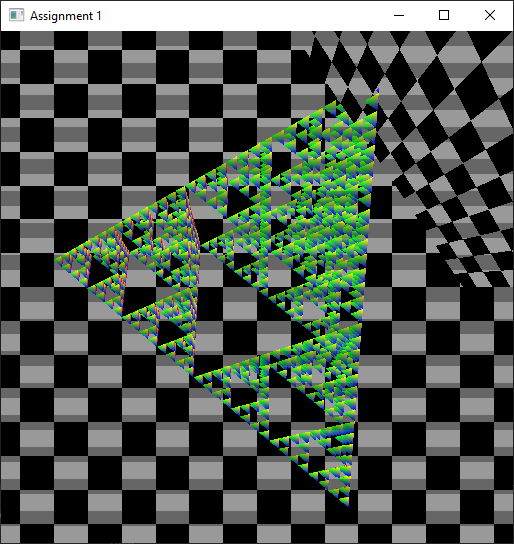

# COMP 4490 Assignment 1
Tested on Windows 10 21H2, with AMD Radeon RX 580 and NVIDIA Geforce RTX 2070.
Compiled using Visual Studio 2022. 

If building for Linux or macOS, makefiles should be modified as the implementation doesn't start with `example`.

# How to Build and Run

Open `A1.sln` and build using VS 2022.

# Implementation choices
For the vertex shader, interpolation is used to create a colour pattern based on `gl_VertexID`.
For the fragment shader, a visible static scan line is applied to the viewport to simulate CRT effect.

# Bugs

When the recursive level >= 5, there are some artifacts in the upper right of the scene. They have the same texture as the checkboard background.
They also clip with the tetrahedrons.
